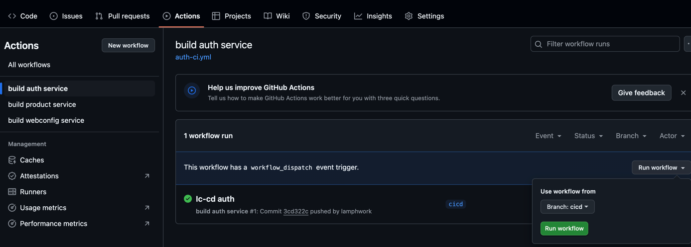

# 🐳 Triển Khai Hệ Thống Microservices với Docker Compose và Github Actions

Hướng dẫn từng bước để build và triển khai hệ thống sử dụng Docker Compose.

## Setup docker hub repository

Để các service có thể được build và đẩy lên Docker Hub tự động qua GitHub Actions, bạn cần thực hiện các bước sau:

### 🧱Tạo repository cho từng service trên Docker Hub

Truy cập https://hub.docker.com, đăng nhập, sau đó tạo 3 repository với các tên như sau:

```
product-service
```

```
auth-service
```

```
webconfig-service
```

⚠️ Lưu ý: Tên image dùng trong docker-compose.yml sẽ có dạng :

```text
docker-user/docker-repo
```

### Tạo Personal Token trên docker hub với quyền read & write


Generate và lưu token lại để dùng cho bước sau

## ⚙️ Tạo cấu hình các dịch vụ(trên server)

### Cấu trúc thư mục

```text
.
├── docker-compose.yml
├── .env
├── product/
│   ├── Dockerfile
│   └── .env
├── auth/
│   ├── Dockerfile
│   └── .env
├── webconfig/
│   ├── Dockerfile
│   └── .env
├── mysql_init_scripts/
│   └── create_database.sql
├── nginx.conf
```

### docker-compose.yml (thay docker-user bằng user docker hub)

```yaml
services:
  redis:
    image: redis:7.4.1
    ports:
      - '6379:6379'
  database:
    image: mysql:8.0
    healthcheck:
      test: ["CMD", "mysqladmin", "ping", "-h", "localhost"]
      interval: 5s
      timeout: 20s
      retries: 5
    ports:
      - '3306:3306'
    environment:
      MYSQL_ROOT_PASSWORD: ${MYSQL_ROOT_PASSWORD}
      MYSQL_USER: ${MYSQL_USER}
      MYSQL_PASSWORD: ${MYSQL_PASSWORD}
      MYSQL_DATABASE: default
    volumes:
      - mysql_data:/var/lib/mysql
      - ./mysql_init_scripts:/docker-entrypoint-initdb.d
  gateway:
    image: nginx:latest
    container_name: api-gateway
    ports:
      - '8888:80'
    volumes:
      - ./nginx.conf:/etc/nginx/nginx.conf:ro
  minio:
    image: quay.io/minio/minio
    ports:
      - '9000:9000'
      - '9001:9001'
    environment:
      MINIO_ROOT_USER: ${MINIO_ROOT_USER}
      MINIO_ROOT_PASSWORD: ${MINIO_ROOT_PASSWORD}
    volumes:
      - minio_data:/data
    command: server /data --console-address ":9001"
  product-service:
    restart: unless-stopped
    image: docker-user/product-service
    env_file:
      - product/.env
    ports:
      - 8081:8080
    depends_on:
      database:
        condition: service_healthy
  webconfig-service:
    restart: unless-stopped
    image: docker-user/webconfig-service
    env_file:
      - webconfig/.env
    ports:
      - 8082:8080
    depends_on:
      database:
        condition: service_healthy
  auth-service:
    restart: unless-stopped
    image: docker-user/auth-service
    env_file:
      - auth/.env
    ports:
      - 8083:8080
    depends_on:
      - database
volumes:
  mysql_data:
  minio_data:
```

Thay docker-user bằng tên người dùng Docker Hub của bạn.

### .env (Cấu hình chung)

```properties
MYSQL_ROOT_PASSWORD=YOUR_ROOT_PASSWORD
MYSQL_USER=YOUR_DB_USER
MYSQL_PASSWORD=YOUR_DB_PASSWORD
MYSQL_DATABASE=default

MINIO_ROOT_USER=YOUR_MINIO_USER
MINIO_ROOT_PASSWORD=YOUR_MINIO_PASS
STORAGE_PUBLIC_HOT=${DOMAIN}/storage
SECRET_KEY=YOUR_SECRET_KEY
```

### product/.env (Cấu hình cho product svice)

```properties
SPRING_PROFILES_ACTIVE=prod
DB_URL=jdbc:mysql://database:3306/product
DB_USER=root
DB_PASS=${MYSQL_ROOT_PASSWORD}
SHOW_SQL=true
DB_POOL_SIZE=20
DB_SHOW_SQL=true

REDIS_ENABLE=false
REDIS_NODES=redis:6379

STORAGE_ENABLED=true
STORAGE_HOST=http:minio:9000
STORAGE_USER=${MINIO_ROOT_USER}
STORAGE_PASS=${MINIO_ROOT_PASSWORD}
STORAGE_PUBLIC_HOST=${STORAGE_PUBLIC_HOT}

```

### auth/.env (Cấu hình cho auth service)

```properties
SPRING_PROFILES_ACTIVE=prod
DB_URL=jdbc:mysql://database:3306/auth
DB_USER=root
DB_PASS=${MYSQL_ROOT_PASSWORD}
SHOW_SQL=true
DB_POOL_SIZE=10
DB_SHOW_SQL=true

REDIS_ENABLE=false
REDIS_NODES=redis:6379

STORAGE_ENABLED=true
STORAGE_HOST=http:minio:9000
STORAGE_USER=${MINIO_ROOT_USER}
STORAGE_PASS=${MINIO_ROOT_PASSWORD}
STORAGE_PUBLIC_HOST=${STORAGE_PUBLIC_HOT}

INIT_USER=YOUR_ADMIN_USER
INIT_PASS=YOUR_ADMIN_PASSWORD
```

### webconfig/.env (Cấu hình cho webconfig service)

```properties
SPRING_PROFILES_ACTIVE=prod
DB_URL=jdbc:mysql://database:3306/webconfig
DB_USER=root
DB_PASS=${MYSQL_ROOT_PASSWORD}
SHOW_SQL=true
DB_POOL_SIZE=10
DB_SHOW_SQL=true

REDIS_ENABLE=false
REDIS_NODES=redis:6379

STORAGE_ENABLED=true
STORAGE_HOST=http:minio:9000
STORAGE_USER=${MINIO_ROOT_USER}
STORAGE_PASS=${MINIO_ROOT_PASSWORD}
STORAGE_PUBLIC_HOST=${STORAGE_PUBLIC_HOT}
```

### mysql_init_scripts/create_database.sql

```sql
create database if not exists product;
create database if not exists webconfig;
create database if not exists auth;
```

### nginx.conf
```text
events {}

http {
    upstream auth_service {
        server auth-service:8080;
    }

    upstream product_service {
        server product-service:8080;
    }

    upstream webconfig_service {
        server webconfig-service:8080;
    }

    upstream storage_service {
        server minio:9000;
    }

    upstream storage_ui {
        server minio:9001;
    }

    server {
        listen 80;

        location ~ ^/api/product(.*) {
            proxy_pass http://product_service/api/v1$1$is_args$args;
            proxy_http_version 1.1;
            proxy_set_header Host $host;
            proxy_set_header X-Real-IP $remote_addr;
            proxy_set_header X-Forwarded-For $proxy_add_x_forwarded_for;
            proxy_set_header X-Forwarded-Proto $scheme;
        }

        location ~ ^/api/webconfig(.*) {
            proxy_pass http://webconfig_service/api/v1$1$is_args$args;
            proxy_http_version 1.1;
            proxy_set_header Host $host;
            proxy_set_header X-Real-IP $remote_addr;
            proxy_set_header X-Forwarded-For $proxy_add_x_forwarded_for;
            proxy_set_header X-Forwarded-Proto $scheme;
        }

        location ~ ^/storage(.*) {
            proxy_pass http://storage_service$1$is_args$args;
            proxy_set_header Host $host;
            proxy_set_header X-Real-IP $remote_addr;
        }

        location ~ ^/api/auth(.*) {
            proxy_pass http://auth_service/api/v1$1$is_args$args;
            proxy_http_version 1.1;
            proxy_set_header Host $host;
            proxy_set_header X-Real-IP $remote_addr;
            proxy_set_header X-Forwarded-For $proxy_add_x_forwarded_for;
            proxy_set_header X-Forwarded-Proto $scheme;
        }

        location ~ ^/ui-storage(.*) {
            proxy_pass http://storage_ui$1$is_args$args;
        }

        location ~ ^/admin.*\.(gif|jpg|jpeg|png|bmp|swf)$ {
            expires 30d;
            proxy_pass https://linh-lang-nextjs.vercel.app;
        }

        location ~ ^/admin {
            proxy_pass https://linh-lang-nextjs.vercel.app;
            proxy_set_header Host linh-lang-nextjs.vercel.app;
            proxy_set_header X-Real-IP $remote_addr;
            proxy_set_header X-Forwarded-For $proxy_add_x_forwarded_for;
            proxy_set_header X-Forwarded-Proto $scheme;
            proxy_ssl_server_name on;
        }

        location / {
            proxy_pass https://linh-lang-storefront.vercel.app;
            proxy_set_header Host linh-lang-storefront.vercel.app;
            proxy_set_header X-Real-IP $remote_addr;
            proxy_set_header X-Forwarded-For $proxy_add_x_forwarded_for;
            proxy_set_header X-Forwarded-Proto $scheme;
            proxy_ssl_server_name on;
        }

        location ~ .*\.(gif|jpg|jpeg|png|bmp|swf)$ {
            expires 30d;
            proxy_pass https://linh-lang-storefront.vercel.app;
        }
    }
}
```
---

### Start các database, gateway và minio trước

```bash
docker-compose up -d database minio
```

## 🔄 Cấu hình CI/CD với GitHub Actions

### Thêm các secret vào setting của GitHub Repository


| Secret          | Ý nghĩa                                    |
|-----------------|--------------------------------------------|
| DOCKER_TOKEN    | Personal token của docker đã lấy phía trên |
| DOCKER_USERNAME | Tên người dùng Docker                      |
| SSH_SERVER      | Địa chỉ IP server để deploy                |
| SSH_USER        | Username đăng nhập server                  |
| SSH_PASS        | Password đăng nhập server                  |

## 🚀 Triển khai qua GitHub Actions
Vào github actions trigger các workflow 
- build auth service
- build product service
- build webconfig service


## Start Gateway
```bash
docker-compose up -d gateway
```


